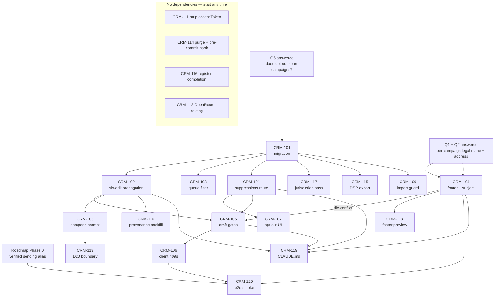

# 03 — Delivery Plan

**Set:** RS-01 · **Status:** Draft for engineering review · **Opened:** 2026-08-21
**Project manager:** Ari Nakos · **Implements:** [01-PRD](01-PRD-outreach-compliance.md) · **Verified by:** [05-QA](05-QA-VERIFICATION.md)

---

## 1. Delivery summary

Twenty-one tickets across three milestones. **M0 "Lawful first send"** clears every P0 requirement and
is a hard gate — no outreach email leaves this app until it closes. **M1 "Evidence is durable"**
follows immediately and covers provenance backfill, the credential-exposure fix, repo hygiene, and
governance. **M2 "Safe to extend"** is trigger-gated rather than scheduled: its two tickets fire on
the day someone sets `OPENROUTER_API_KEY` or opens the message-store design, and not before. The
work is done when a draft created for any imported contact is lawful in that contact's
jurisdiction without the operator remembering anything, and an opt-out recorded once is honored by
every path in the system including a re-import.

**Critical path:** `CRM-101 → CRM-102 → CRM-105 → CRM-106 → CRM-120`. Everything else is
parallelisable. Estimated 5 working days of serial work on that chain, plus Phase 0 landing before
the final smoke test can run. `CRM-121` (the suppressions route) sits off the spine but gates
`CRM-105` and `CRM-107`, so it wants to be done early on day two.

---

## 2. Milestones

### M0 — Lawful first send

> **Hard gate. No outreach email is sent from this app, by anyone, for any contact, until M0 exit
> criteria are met and signed off.** This is not a guideline. The whole point of the effort is that
> the first send is the irreversible event.

| | |
| --- | --- |
| **Requirements** | REQ-01, 02, 03, 04, 05, 06, 06c, 07, 10, 10b, 17 (all P0) |
| **Tickets** | CRM-101 … 109, 117, 119, 120, 121 |
| **Entry criteria** | **Q1, Q2 and Q6 answered by Product.** Q1 must also confirm there is one sending legal entity, not several — if there are several, REQ-06 changes shape. Q6 decides whether an opt-out spans campaigns and gates `CRM-101`, because the two answers give different schemas. Engineers have read `CLAUDE.md` and `AGENTS.md`. Working tree clean. |
| **Exit criteria** | VER-01, 01b, 02, 03, 04, 05, 06, 07, 10, 10b and 17 in doc 05 all pass. **Every contact with an email address (23 today) carries a non-null `jurisdiction`** — note this spans all three projects, not the 17 partner rows alone. A real draft has been created and its raw message inspected in Gmail, footer and subject line both. `npm run lint` reports exactly 3 pre-existing `set-state-in-effect` errors. |
| **Unblocks** | The first outreach send. Nothing else in the product is blocked on this. |
| **Est. duration** | 5 working days on the critical path; 2 engineers comfortably, 3 with idle time. |

### M1 — Evidence is durable

| | |
| --- | --- |
| **Requirements** | REQ-06b, 08, 09, 11, 15, 16, 18 (all P1) |
| **Tickets** | CRM-110, 111, 114, 115, 116, 118 |
| **Entry criteria** | M0 signed off. CRM-117's jurisdiction data recorded. |
| **Exit criteria** | Zero contact rows with `sourceType = null`, across all three projects. Every waitlist row has a non-null `consentedAt`. Page payload contains no Google access token **and the expired-session re-auth button still renders**. Doc 04 has no empty owner or review cells. Pre-commit hook rejects a staged `*.db`. |
| **Unblocks** | Answering a data-subject request without improvisation. Safe operation of a public repo holding a private database. |
| **Est. duration** | 3 working days, fully parallelisable. |

### M2 — Safe to extend

> **Trigger-gated, not scheduled.** Do not pull these forward for tidiness. Each has a named
> forcing event; until it fires, the ticket sits.

| | |
| --- | --- |
| **Requirements** | REQ-13, REQ-14 (P1, trigger-gated) · REQ-12 (P2, no ticket yet) |
| **Tickets** | CRM-112, CRM-113 |
| **Trigger — CRM-112** | The day anyone sets `OPENROUTER_API_KEY` in a `.env` that will see real contact notes. Roadmap E9's own trigger, unchanged. |
| **Trigger — CRM-113** | The day the message-store design is opened, i.e. the moment someone asks again whether the archive holds message bodies. |
| **Trigger — REQ-12** | **Roadmap Phase 0 task 0.d landing** (Internal consent removes refresh-token expiry), or the first non-localhost deployment — whichever is first. 0.d is in flight and owner-owned, so this is likely to fire *during* M0. Raise a ticket the day it closes; do not wait for M1 sign-off. |
| **Exit criteria** | Completion requests carry non-retaining provider routing on a GA model. `D20` is recorded in `docs/ROADMAP.md` §2 and the compose brief construction enforces the boundary. |
| **Unblocks** | Turning the LLM composer on with real contact data. Designing the Gmail-derived message store. |

---

## 3. Epics

| Epic | Outcome | Rolls up |
| --- | --- | --- |
| **EPIC-A** Consent & Suppression | An opt-out recorded once **against a person** is honored permanently by the queue, the draft route, and the import script — in every campaign they appear in, and after their contact row is deleted. | REQ-01, 02, 03, 04, 05, 08, 09 |
| **EPIC-B** Message Compliance | Every message the app builds is lawful on its face and arrives intact, without depending on the model or the operator to remember. | REQ-06, 06b, 06c, 07, 17 |
| **EPIC-C** Jurisdiction | The app knows where a recipient is and refuses a first contact into a consent-first jurisdiction without consent or an explicit acknowledgement. | REQ-10, 10b |
| **EPIC-D** Data Protection & Third Parties | No credential leaks to a client, no contact data reaches a third party or the public repo unintentionally. | REQ-11, 12, 13, 14, 16 |
| **EPIC-E** Governance | A stranger inheriting this repo can find the control, its owner, and its evidence. | REQ-15, 18 |

---

## 4. Ticket backlog

Size key — **S** ≤ 2h · **M** ≤ 1 day · **L** > 1 day. Sizes assume an engineer who has read
`CLAUDE.md`; the first ticket for anyone who hasn't is one size larger.

| Ticket | Title | Epic | Implements | Size | Depends on | Milestone |
| --- | --- | --- | --- | --- | --- | --- |
| **CRM-101** | Migration `add_consent_and_suppression` — `Account` columns and the `Suppression` table, schema only, no call sites | A | REQ-01, 08, 10 | S | **Q6** | M0 |
| **CRM-102** | Propagate new columns through all four write sites + vocabulary constants + `Suppression` type | A | REQ-08, 10 | M | 101 | M0 |
| **CRM-103** | `GET /api/queue` suppression filter, address-scoped | A | REQ-02 | S | 101 | M0 |
| **CRM-121** | `POST /api/suppressions` + the derived `optedOutAt` on `GET /api/accounts` | A | REQ-01 | M | 101 | M0 |
| **CRM-104** | Compliant footer in `buildRawMessage`, env config, fail-closed guard, RFC 2047 subject | B | REQ-06, 06c | M | Q1, Q2 | M0 |
| **CRM-105** | Draft-route suppression + jurisdiction gates (409, pre-Gmail-call) | A, C | REQ-03, 10 | M | 101, 102, 121, **104** | M0 |
| **CRM-106** | Client: surface 409s; add the missing `catch` in `createDraft` | A, C | REQ-03, 10 | M | 105 | M0 |
| **CRM-107** | Opt-out control in `account-detail`; suppression banner and disabled compose | A | REQ-05 | M | 121 | M0 |
| **CRM-108** | Compose prompt amendments (lines 40, 45) + `sourceType` in the brief | B | REQ-07, 17 | S | 102 | M0 |
| **CRM-109** | Import-script suppression guard with per-address skip logging | A | REQ-04 | S | 101 | M0 |
| **CRM-117** | *Non-engineering.* Jurisdiction pass over **all 23 emailable contacts across three projects** — research **and** record | C | REQ-10b | M | 101 | M0 |
| **CRM-119** | Update `CLAUDE.md` and `.env.example` for the new invariants | E | DoD | S | 102, 104, 105 | M0 |
| **CRM-120** | End-to-end smoke: create a real draft, inspect the raw message in Gmail | — | Success criterion 1 | M | 104, 105, 106, **Phase 0** | M0 |
| **CRM-110** | Provenance backfill for all 34 pre-existing rows across three projects | A | REQ-09 | M | 102 | M1 |
| **CRM-111** | Strip `accessToken` — and only `accessToken` — from the RSC payload | D | REQ-11 | S | — | M1 |
| **CRM-114** | Purge scratch DB copies; pre-commit hook for the public repo | D | REQ-16 | S | — | M1 |
| **CRM-115** | DSR export script (`prisma/export-contact.ts`) | E | REQ-15 | M | 101 | M1 |
| **CRM-116** | *Non-engineering.* Complete the compliance register — owners, review dates | E | REQ-18, 15 | S | — | M1 |
| **CRM-118** | Footer preview in the composer, matching what the route appends | B | REQ-06b | M | 104 | M1 |
| **CRM-112** | OpenRouter non-retaining provider routing + GA model pin | D | REQ-14 | S | — | M2 *(trigger)* |
| **CRM-113** | Record `D20`; enforce the Gmail-derived boundary in the compose brief | D | REQ-13 | S | 108 | M2 *(trigger)* |

### Ticket notes engineers will otherwise get wrong

| Ticket | Trap |
| --- | --- |
| **CRM-101** | Schema **only**. Do not touch call sites in this ticket. It is deliberately split so that every other schema-touching branch can rebase onto one committed migration instead of racing it. One migration covers all three changes — `Account` columns, `Project` columns, `Suppression` table. Blocked on **Q6**, not on code: if an opt-out does *not* span campaigns, the table is the wrong shape and this ticket changes. |
| **CRM-102** | Adding a column to `Account` in this repo means **four edits**: `prisma/schema.prisma`, the POST create in `app/api/accounts/route.ts`, the PATCH whitelist in `app/api/accounts/[id]/route.ts`, and `lib/types.ts`. **`consentedAt` is a date: it belongs in the second PATCH loop that calls `new Date()`, not the plain whitelist loop.** A date placed in the plain loop stores a string and fails silently. Nothing about suppression belongs in either accounts route. |
| **CRM-103** | Filter by **address**, not by a column on the row: read the suppressed set, then `email: { notIn: … }`, independent of `QUEUE_EXCLUDED_STATUSES`. **Check that contacts with a null email still appear** — SQL `NOT IN` against `NULL` excludes the row, and 11 of 34 contacts have no address. TRD §5.1 carries the fallback clause. |
| **CRM-121** | New route, and the only writer of `Suppression`. `upsert`, not `create` — a second opt-out from the same person must not 409, and the **first** timestamp is the one that matters legally, so never overwrite `optedOutAt`. Return the `affected` account ids so `CrmApp` can splice them; nothing refetches in this codebase. |
| **CRM-104** | Blocked on Q1/Q2, not on code. Do not start until Product has supplied the legal name and postal address — **and confirmed there is one entity, not several.** Fail **closed**: a missing or blank address must refuse draft creation, not emit a footer with a gap in it. Check with a trimmed logical-OR, not nullish coalescing, or a blank `.env` line reads as configured. Also carries REQ-06c (RFC 2047 subject) — same function, and without it the CRM-120 smoke test fails looking like a footer bug. |
| **CRM-105** | Both gates must run **before** the Gmail API call. The suppression check is a lookup on the *recipient address*, not a field on the loaded account. The account is already loaded for `Project.fromEmail`, so widening its `include` costs no extra query. **File conflict with CRM-104** — same file, same function region. Same owner, or strictly sequenced. |
| **CRM-106** | `createDraft` currently has a `finally` and no `catch`, so a non-JSON error response makes `res.json()` throw and the user sees nothing. Fix that while you are in there; a 409 the user cannot see is not a gate. |
| **CRM-107** | `account-detail` is an inline auto-saving form with a known in-flight race (roadmap E6). Do **not** implement opt-out as another blur-fired field patch — it is a dedicated dialog firing one POST to `/api/suppressions`. That route is not covered by `patch()`'s rollback-and-toast, so it needs its own `catch`; model it on `composeWithLlm`. Derive the banner from `local`, not from new state, or the lint count goes to 4. |
| **CRM-109** | The import script bypasses the API entirely — this is roadmap E8. This ticket does not fix E8 generally; it fixes the one case where bypass has legal consequence. With the suppression table the check is a primary-key read, not a cross-project scan. |
| **CRM-110** | Preserve the original `notes` text. `consentedAt` is promoted **out of** prose, not moved out of it. Losing the prose loses the corroborating detail. **Three projects, not two** — `MichiKanji — Shodo Schools` has 8 rows and is missing from most of this document set's prose. |
| **CRM-111** | Strip `accessToken` and **nothing else**. `top-bar.tsx:34-36` now reads `session.error` to render the expired-session re-auth button; stripping that field reverts a shipped fix and VER-11 would still pass. |
| **CRM-117** | **23 emailable contacts across three projects**, not 17 partner rows. Both Japanese-reading domains at PRD F8 are in `MichiKanji — Shodo Schools`, and JP is consent-first — so the project this document set says least about is the one where the gate matters most. |
| **CRM-119** | `CLAUDE.md` is load-bearing in this repo — it is how the next agent or engineer learns which apparent bugs are deliberate. A new enforcement invariant that is not documented there will be "cleaned up" by someone within a month. |
| **CRM-120** | Gated on roadmap **Phase 0** (Workspace tenant, verified sending alias). If Phase 0 slips, run the smoke against the default mailbox identity and record the gap — do not let it block M0 sign-off indefinitely. See risk R1. |

---

## 5. Dependency graph

**Read this as:** one serial spine, one hard external dependency (Phase 0), **two** product
dependencies (Q6 gating the migration, Q1/Q2 gating the footer), and a four-ticket cluster that
anyone idle can pick up on day one.

---

## 6. Sequencing

### The rule for day one

> **CRM-101 is done first, alone, by one person, and committed before anything else starts.**

Every other schema-touching ticket rebases onto it. Two engineers running `prisma migrate dev` in
parallel produce two migration directories with conflicting timestamps and a broken
`migration_lock` story that costs more to unpick than the ticket costs to write. It is an S-sized
ticket. Do it, commit it, tell everyone, then fan out.

### Week 1 — M0

| Day | Engineer 1 (critical path) | Engineer 2 | Engineer 3 / Product |
| --- | --- | --- | --- |
| **1** | **CRM-101** alone, once **Q6** is answered. Commit and announce. | Read `CLAUDE.md` + `AGENTS.md`. Then CRM-111, CRM-114. | **Product answers Q6 first, then Q1 + Q2.** Begin CRM-117 research (no schema needed to research). |
| **2** | CRM-102 — the six-edit propagation. The date-coercion trap lives here. | **CRM-121** — suppressions route, then CRM-103. | CRM-117 recording (needs CRM-101 landed). |
| **3** | CRM-104 — footer + subject encoding. Unblocked only if Q1/Q2 landed on day 1. | CRM-109, then CRM-116. | CRM-117 continues — 23 rows, three projects. Product reviews footer copy. |
| **4** | CRM-105 — draft gates. Same file as CRM-104, same owner by design. | CRM-107 — opt-out UI, on top of 121. | CRM-115 DSR export. |
| **5** | CRM-106 — client 409 surfacing + the missing `catch`. | CRM-108, then CRM-119 — `CLAUDE.md` and `.env.example`. | Doc 05 verification dry-run, VER-01 … VER-05. |

### Week 2 — M0 close, then M1

| Day | Engineer 1 | Engineer 2 | Engineer 3 / Product |
| --- | --- | --- | --- |
| **6** | **CRM-120** e2e smoke. Gated on Phase 0 — if it has slipped, invoke risk R1's fallback. | CRM-118 footer preview. | Doc 05 verification, VER-06 … VER-10. |
| **7** | **M0 sign-off review.** Walk doc 05 end to end with the reviewer present. | CRM-110 provenance backfill. | Register rows updated for every M0 ticket. |
| **8** | CRM-110 review + backfill dry-run against a DB copy before the real run. | Buffer / carry-over. | CRM-116 completion pass. |
| **9** | M1 verification pass. | Buffer / carry-over. | Q4, Q5 with counsel. |
| **10** | **M1 sign-off.** M2 tickets raised but **not started** unless a trigger has fired. | — | Close out RS-01; archive if no follow-on. |

### What is strictly serial vs parallel

| | Tickets | Why |
| --- | --- | --- |
| **Strictly serial** | 101 → 102 → 105 → 106 | Migration, then call sites, then routes that consume them, then the client that consumes the routes. |
| **Serial by file conflict, not logic** | 104 → 105 | Both edit `app/api/gmail/draft/route.ts` in the same region. Give them to one engineer or sequence them. |
| **Parallel after 101** | 103, 109, 115, 117, 121 | They read the schema but not the propagated types. 121 is its own route and its own table. |
| **Parallel after 102** | 108, 110 | Independent consumers of the same columns, in different files. |
| **Parallel after 121** | 107 | The opt-out UI has nothing to call until the route exists. |
| **Parallel from day one** | 111, 114, 116, 112 | Touch no schema and no shared file. Ideal warm-up work while CRM-101 lands. |
| **Blocked externally** | 101 (Q6), 104 (Q1/Q2), 117 (Product judgement), 120 (Phase 0) | Not engineering-blocked. Chase these early; they are the ones that actually slip — and Q6 now blocks day one, so chase it first. |

---

## 7. Definition of Ready

A ticket is not picked up until all of these hold.

- [ ] It cites at least one `REQ` from doc 01, and the acceptance criteria there are unambiguous.
- [ ] Its dependencies are **merged**, not merely in review.
- [ ] Any blocking open question (Q1–Q6) is answered and the answer is written into the ticket. **Q6 blocks `CRM-101` and Q1 blocks `CRM-104`** — both sit on day one.
- [ ] The matching `VER` procedure in doc 05 exists, so "done" is testable before work starts.
- [ ] Size is agreed. A ticket nobody will size is a ticket nobody understands.

## 8. Definition of Done

All of these, for every ticket. No partial credit.

- [ ] The cited `REQ`'s acceptance criteria are satisfied — read them again at the end, not from memory.
- [ ] The matching `VER` procedure in doc 05 passes, executed by someone other than the author.
- [ ] `npm run lint` reports **exactly 3** pre-existing `set-state-in-effect` errors. Not four. If your change adds one, it is not done.
- [ ] `CLAUDE.md` is updated if an architectural invariant changed — a new enforcement point, a new field-list edit site, a new env var.
- [ ] The corresponding row in doc 04 (compliance register) is updated with the implementing ticket and evidence pointer.
- [ ] Working tree clean apart from `.claude/settings.local.json`, which is intentionally untracked.

> **"Tests pass" is deliberately absent.** There is no test framework in this repository and this
> effort does not introduce one — that would be a larger decision than this plan is entitled to
> make. Verification is the manual procedure in doc 05, executed by a second person. Do not
> substitute a hastily-added test runner for that; the manual procedure is the contract.

---

## 9. Roles

At current team size several of these are the same human. **The value is the checklist, not the
org chart** — the point is that each column gets deliberately considered once per ticket, not that
five people exist.

| Role | Responsible for | Consulted on | Not theirs |
| --- | --- | --- | --- |
| **Product Owner** | Q1–Q6 answers, footer copy, CRM-117 judgement calls, M0/M1 sign-off, register ownership | Every `REQ` change | Implementation sequencing |
| **Tech Lead** | Ticket sizing, the CRM-101-first rule, file-conflict calls, `CLAUDE.md` accuracy | Scope disputes | Legal interpretation |
| **Fullstack Engineers** | CRM-101 … 115, 118 … 120 | Sizing, dependency ordering | Deciding whether a requirement is needed |
| **QA / Reviewer** | Executing doc 05, DoD enforcement, second-person verification | Acceptance-criteria wording | Writing the code they verify |
| **Counsel** *(spot review only)* | Q4 (DPA necessity), Q5 (privacy notice), a read of PRD §7 | Footer wording, jurisdiction classification | Everything else — do not route engineering decisions here |

**One rule that survives the role collapse:** the person who wrote a ticket does not sign off its
`VER` procedure. If that is genuinely impossible, the sign-off is recorded as self-verified in doc
05, so the weaker evidence is visible rather than implied.

---

## 10. Risk register

| # | Risk | Likelihood | Impact | Mitigation | Owner | Trigger |
| --- | --- | --- | --- | --- | --- | --- |
| **R1** | Roadmap **Phase 0** (Workspace tenant, verified sending alias) slips, blocking CRM-120 end-to-end verification. | **High** — it has already slipped once and is owner-owned, not engineering-owned. | Medium. M0 cannot be *fully* signed off; the code is still correct. | Run CRM-120 against the default mailbox identity with `Project.fromEmail` null, which the route already degrades to cleanly. Record the alias gap as an open item rather than blocking M0. Re-run once Phase 0 lands. | Product | Day 6 arrives with no verified alias. |
| **R2** | **Q1** (legal entity name + postal address) unanswered, blocking CRM-104. | **Medium.** It requires a real decision about which entity is sending. | **High.** Blocks 104 → 120. | Front-loaded to day 1 in the sequence deliberately. If unanswered by end of day 1, escalate and reorder: pull CRM-121 and CRM-107 forward and slip 104 by a day. Do **not** ship a placeholder address. If the answer turns out to be *more than one entity*, stop and raise it — REQ-06 changes shape and doc 01 §10 carries the trigger. | Product | End of day 1. |
| **R3** | **Q3 / CRM-117** jurisdiction pass unfinished, so REQ-10b fails and M0 cannot close. | **Medium-high.** It is **23 rows** of human judgement across **three** projects with no automation available (PRD N1), and the project easiest to forget is the one holding the two Japanese-reading domains. | High — it is a P0 exit criterion, and JP is consent-first. | Start research on day 1 before the schema exists; only the *recording* step needs CRM-101. Timebox to 3h. Anything genuinely ambiguous is recorded as `UNKNOWN` and treated as consent-first, which fails safe. | Product | End of day 3. |
| **R4** | **CRM-101 races uncommitted work.** Two branches generate migrations, or someone starts a schema-touching ticket before 101 lands. | Medium — this is the single most common way small teams lose a day. | Medium. Costs a day of unpicking `migration_lock` and duplicate migration directories. | The day-one rule in §6: 101 alone, committed and announced before fan-out. Confirm a clean working tree before starting. No parallel `prisma migrate dev`. | Tech Lead | Anyone opens a schema-touching branch on day 1. |
| **R5** | The known in-flight-guard defect (**roadmap E6**) causes a slow PATCH to overwrite a suppression write, silently un-suppressing a contact who asked not to be emailed. | **Low, and now structurally lower** — suppression lives in a different table written by a different route (CRM-121), so `patch()` cannot touch it even by mistake. The residual risk is an engineer routing it back through `patch()` for convenience. | **High.** A lost suppression write is the exact failure the project exists to prevent, and it is invisible. | CRM-107 calls `POST /api/suppressions` and nothing else. Reviewers reject any diff that adds a suppression field to either accounts route. Doc 05 verifies suppression by re-reading the `Suppression` table directly, not by trusting the UI. | Tech Lead | Any observed lost edit; or CRM-107 review. |
| **R9** | **Q6 answered "no"** — the operator wants opt-outs scoped per campaign after all — *after* CRM-101 has been committed with a person-scoped table. | Low, but the cost is asymmetric. | High. The migration is the one artifact every other branch rebases onto (R4), so changing its shape on day 3 costs more than the ticket. | Q6 is an entry criterion for M0 and a hard dependency of CRM-101 in §5. Do not start the migration on a verbal "probably." If the answer is genuinely undecidable, build the table anyway — a person-scoped record is the stricter reading of both CAN-SPAM's sender test and GDPR Art 21(2), and narrowing later is a filter, whereas widening later is a data migration with no source of truth for which campaign each opt-out belonged to. | Product | Day 1, before CRM-101 starts. |
| **R10** | The suppression filter in **CRM-103** silently drops every contact with no email address, because SQL `NOT IN` against `NULL` excludes the row. | **Medium** — it reads correctly and is easy to miss. | Medium. 11 of 34 contacts have no address; the queue would quietly shrink by a third with no error. | TRD §5.1 names the failure and carries the fallback clause. `VER-05` and regression `R5` both check the null-email rows explicitly. Compare queue length before and after the change on real data, not on fixtures. | Engineer 2 | CRM-103 review. |
| **R6** | **Scope creep back into parked roadmap items** — per-user auth, the message index, reply-rate stats, an ESP, the `Account`→`Contact` rename. | **High.** Every one of these is adjacent to something this plan touches, and each has a plausible-sounding justification. | High. This repo has already demonstrated exactly this failure mode once (roadmap revision 2: 40 tasks, 4 shipped). | PRD §5 lists the non-goals explicitly for citation in review. Anything outside RS-01 becomes a roadmap line with a trigger, not a ticket in this plan. The reviewer is empowered to reject on scope alone. | Project Manager | Any PR touching a file outside the TRD's stated surface. |
| **R7** | Backfill (**CRM-110**) corrupts or loses the prose in `notes` while promoting signup dates out of it. | Low. | High — that prose is the corroborating consent evidence, and there is no test suite to catch it. | Dry-run against a copy of the database first, diff the `notes` column before and after, and confirm zero rows changed. Take a backup that is *not* in a session scratch directory (see CRM-114). | Engineer 1 | Before the real run, always. |
| **R8** | A footer that fails closed (**CRM-104**) blocks all drafting if the env var is missing on a fresh clone, and gets "fixed" by making it fail open. | Medium. | High — a footer that silently omits itself is worse than no footer, because it looks compliant. | Fail-closed is specified deliberately in REQ-06 and documented in `CLAUDE.md` via CRM-119, alongside the existing `proxy.ts` tripwire idiom it mirrors. The error message must name the missing env var, and filling it in is a one-line fix — there is no case for failing open. Watch for the subtler version: nullish coalescing (`??`) instead of logical-OR, which accepts a blank `.env` line as configured and emits a footer with a gap. | Tech Lead | Any PR relaxing the guard. |

---

## 11. Reporting & change control

### Cadence

| What | When | To whom | Contents |
| --- | --- | --- | --- |
| Standup note | Daily, async | Team | Ticket moved, blocked, or at risk. Named blockers only — "in progress" is not a status. |
| Milestone gate review | End of M0, end of M1 | Product + reviewer | Doc 05 walked end to end, live. Exit criteria read aloud against evidence, not from memory. |
| Risk review | Day 3 and day 8 | Project Manager + Product | R1–R8 re-scored. Any risk that fired gets a decision, not a re-score. |
| Register upkeep | Per ticket, at DoD | — | Doc 04 row updated. This is part of Done, not a separate task. |

### Change control

- A material change to any `REQ` **after engineering sign-off** requires a line in the change log
  in [00-INDEX.md](00-INDEX.md) and a note to the ticket owner. Clarity and typo fixes do not.
- A change to a ticket's **acceptance criteria** requires the matching `VER` procedure in doc 05 to
  be updated in the same commit. A `VER` that no longer matches its `REQ` is worse than no `VER`.
- New work discovered mid-flight goes to `docs/ROADMAP.md` with a trigger — **not** into this plan.
  See R6. This set is scoped to one outcome and should be closed out, not extended.

---

## 12. Explicitly not in this plan

See [PRD §5 — Non-goals](01-PRD-outreach-compliance.md#5-non-goals) for the full list with
rationale. In short: no jurisdiction rules engine, no preference centre, no per-user auth or
multi-tenancy, no automated DSR fulfilment, no bulk send or ESP, and no general campaign to
validate every free-text field in the schema.

Two things that are *adjacent* and still out of scope, named because they will come up in review:

| Item | Why not here | Where it goes |
| --- | --- | --- |
| Fixing roadmap **E7** generally (server-side status/kind validation) | This plan makes suppression un-expressible as a status — and now un-expressible as an `Account` column at all — which removes the legal consequence of E7 without taking on schema-wide validation. | Roadmap, existing E7 row, unchanged trigger. |
| Per-campaign footer identity as columns on `Project` | The footer names a legal entity, which sits above a campaign — two Mangood projects share one sender, so a column would store it twice. The tier that owns it is the Product tier, parked under D16. | Doc 01 §10, with the trigger: a second legal entity starts sending. |
| A `Contact` tier above `Account`, or de-duplicating people across campaigns generally | PRD **N7**. `Suppression` is keyed on the address because suppression is the one thing that must be person-scoped. Nothing else in this effort is, and inferring a general identity model from one table is exactly the scope creep R6 describes. | Roadmap, `Account`→`Contact` rename (D18), unchanged trigger. |
| Inbound reply detection, so a "stop" reply is *seen* rather than relied on being noticed | PRD **F16**. The footer advertises a reply-based opt-out into a mailbox the app cannot read; `gmail.compose` grants no read access, and widening the scope is a re-consent event with its own review (doc 04 §8). Recorded as a residual risk, not engineered around. | Roadmap. Trigger: first opt-out noticed late, or the day the message index is built. |
| Fixing roadmap **E8** generally (writes that bypass the API skip the audit log) | CRM-109 fixes the one case with legal consequence. The general fix is a larger decision about whether scripts may bypass the API at all. | Roadmap, existing E8 row, unchanged trigger. |
